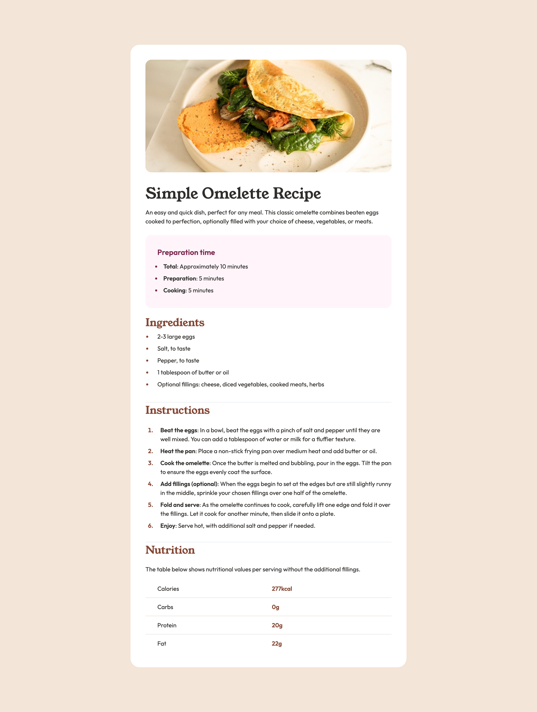

# Frontend Mentor - Recipe page solution

This is a solution to the [Recipe page challenge on Frontend Mentor](https://www.frontendmentor.io/challenges/recipe-page-KiTsR8QQKm). Frontend Mentor challenges help you improve your coding skills by building realistic projects. 

## Table of contents

- [Overview](#overview)
  - [The challenge](#the-challenge)
  - [Screenshot](#screenshot)
  - [Links](#links)
- [My process](#my-process)
  - [Built with](#built-with)
- [Author](#author)
- [Acknowledgments](#acknowledgments)

## Overview

### Screenshot

### Links

- Solution URL: [Frontend Mentor](https://www.frontendmentor.io/solutions/-recipe-page-with-tailwind-css-VieStDyRwF)
- Live Site URL: [Netlify](https://bejewelled-dragon-894e3a.netlify.app/)

## My process

### Built with

- Semantic HTML5 markup
- Flexbox
- Mobile-first workflow
- [Tailwind](https://tailwindcss.com/)

## Author

- LinkedIn - [Jessica Arvizu](https://www.linkedin.com/in/jessica-arvizu/)
- Frontend Mentor - [@jessicaArvizu](https://www.frontendmentor.io/profile/jessicaArvizu)
- GitHub - [@jessicaArvizu](https://github.com/jessicaArvizu)

